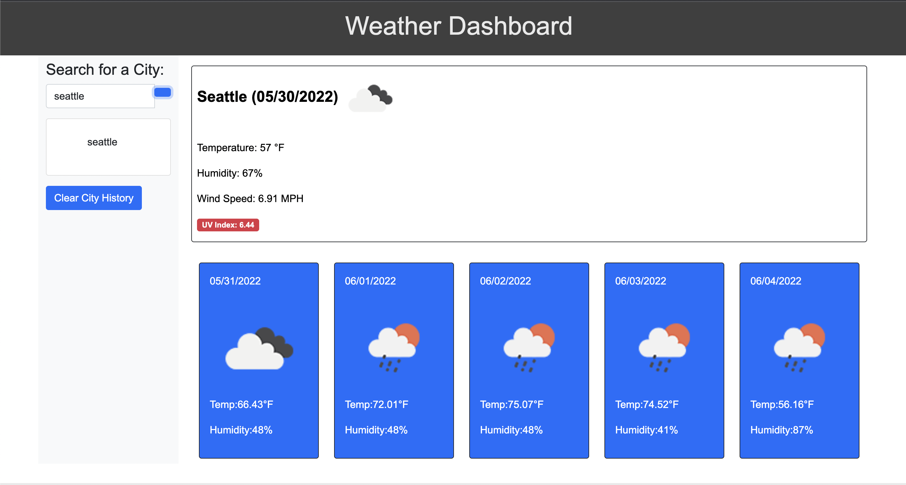

# Weather-Dashboard-EK

**Link**

https://elliottpkim.github.io/Weather-Dashboard-EK/

Attempted to make a Weather Dashboard to be able to search up any city and get its weather information using an API.

Was unable to figure out how to make the API run to get information will study on it to resubmit.
Search bar is also unfinished but I believe my local storage should work.

